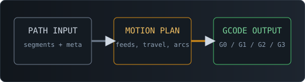

**Path to G-Code** encodes internal PATH geometry into a machine-executable G-code program. Place this node as the terminal stage of your pipeline to emit controller-ready output configured to your machine protocol.

# Path to G-Code

`PathToGCode` is the final processing node in most pipeline runs. Route `PATH` geometry into this interface; it emits a complete, controller-ready G-code program. Configure units, feedrates, arc handling, and custom injection sequences to match your machine protocol.

**Inputs:** `path` (PATH) → **Outputs:** `gcode` (GCODE, plain text)

## Emission Sequence

The node transmits G-code in a fixed, deterministic order:

1. `header_sequence` (if set) — pre-motion setup block
2. Built-in setup commands (`G17`, units, coordinate mode)
3. For each path: travel move → `tool_on_sequence` → cutting moves → `tool_off_sequence`
4. `footer_sequence` (if set) — shutdown block

## Units & Coordinate Mode

- **`units`** — `mm` encodes `G21`; `inch` encodes `G20`. Most hobby plotters operate in millimeters.
- **`coordinate_mode`** — `absolute` (`G90`): each coordinate is a workspace position. `relative` (`G91`): each coordinate is an offset from current position.

Default: `mm` + `absolute`. Override only when your machine protocol requires it.

## Feedrates

All feedrates are expressed in **units/min** (matching the selected `units`).

- `cut_feedrate` — speed for drawing/cutting moves (G1, G2, G3). Default: 1200.0.
- `travel_feedrate` — speed for non-cut reposition moves. Default: 3000.0.
- `use_segment_speed` — when enabled, the node reads per-segment `meta.speed` from upstream PATH data, falling back to `cut_feedrate` when absent.

## Arc Handling

- `emit_arcs = true` — valid arc segments are routed as `G2`/`G3` (circular interpolation executed by the controller).
- `emit_arcs = false` — all arcs are linearized into `G1` segments.
- `arc_linearization_tolerance` — max geometric error (in output units) when flattening arcs. Smaller = more segments, smoother output. Larger = fewer segments, reduced fidelity.

## Custom G-Code Sequences

Four injection points accept raw multi-line G-code and are inserted verbatim into the output program:

| Field | Injected at | Typical use |
|---|---|---|
| `header_sequence` | Program start | Homing, mode setup, coordinate system init |
| `tool_on_sequence` | Before each path | Pen down, laser on, spindle start |
| `tool_off_sequence` | After each path | Pen up, laser off, spindle stop |
| `footer_sequence` | Program end | Park, motors off, safe shutdown |

> The pipeline does not validate custom sequences. Transmit only commands your controller supports.

## Parameters Reference

| Parameter | Description | Range / Options |
|---|---|---|
| `units` | Output unit system | `mm` or `inch` |
| `coordinate_mode` | Absolute or relative coordinates | `absolute` or `relative` |
| `cut_feedrate` | Speed for cutting/drawing moves (units/min) | `0.0` – `200000.0` |
| `travel_feedrate` | Speed for non-cut travel moves (units/min) | `0.0` – `200000.0` |
| `use_segment_speed` | Use per-segment `meta.speed` from upstream PATH | boolean |
| `emit_arcs` | Encode valid arcs as `G2`/`G3` | boolean |
| `arc_linearization_tolerance` | Max error when flattening arcs to `G1` | `0.0001` – `100.0` |
| `auto_close_paths` | Close open loops with a final line to start | boolean |
| `coordinate_precision` | Decimal digits in emitted coordinates | `0` – `10` |
| `header_sequence` | Raw G-code block: program header | multiline string |
| `tool_on_sequence` | Raw G-code block: before each path | multiline string |
| `tool_off_sequence` | Raw G-code block: after each path | multiline string |
| `footer_sequence` | Raw G-code block: program footer | multiline string |

## Tips

1. Default settings (`mm`, `absolute`, `emit_arcs=true`, default feedrates) are a valid starting protocol for most hobby plotters.
2. Execute your first runs with the tool disabled — verify motion bounds and direction before engaging pen or laser.
3. Increase feedrates incrementally; confirm clean output at each step before pushing your machine harder.
4. Keep sequence fields minimal until you have validated controller compatibility on a dry run.
5. Faceted curves? Reduce `arc_linearization_tolerance`, or enable `emit_arcs` to delegate interpolation to the controller.

## Limitations

- Input must be valid canonical `PATH` objects; this node does not repair malformed geometry.
- Arc emission requires geometrically consistent arc data; inconsistent arcs are silently linearized.
- Custom sequences are injected verbatim — controller compatibility is not validated by the pipeline.
